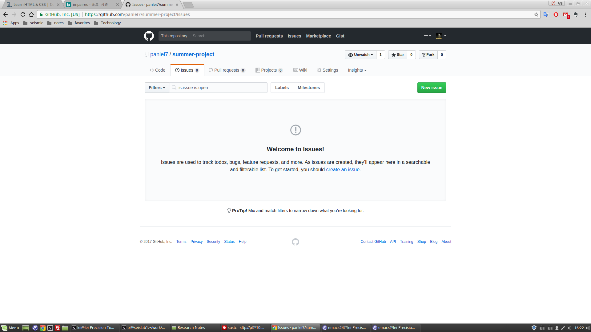
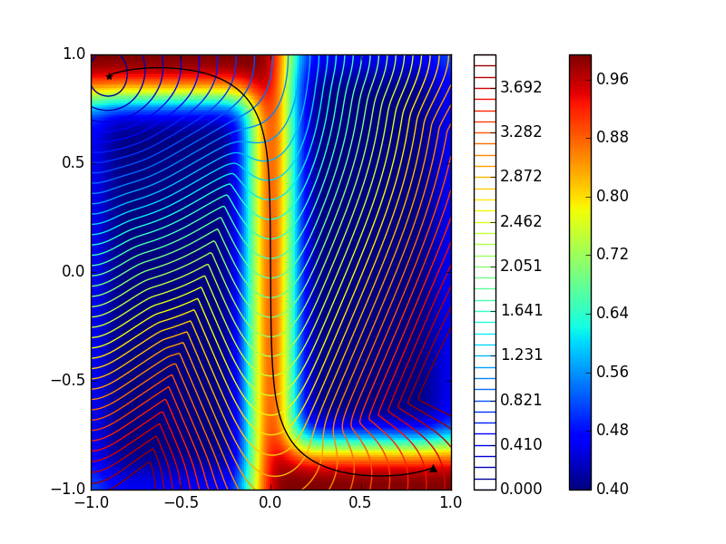

# Project1

## 提前内容

1. 安装pygmo库（提供更快的DE算法支持）
   1. 更换conda源为清华源
   ```bash
   > conda config --add channels https://mirrors.tuna.tsinghua.edu.cn/anaconda/pkgs/free/
   > conda config --set show_channel_urls yes
   > conda config --add channels https://mirrors.tuna.tsinghua.edu.cn/anaconda/cloud/conda-forge/
   ```
   2. 安装pagmo（pygmo依赖的C++库）
   ```bash
   > conda install pagmo
   ```
   3. 安装pygmo
   ```bash
   > conda install pygmo
   ```

2. 下载代码

   ```bash
   > git clone https://github.com/panlei7/summer-project.git
   ```
   如果没有git命令，可以安一个
   ```bash
   > sudo apt-get install git
   ```

   反演程序来自scipy和pygmo，正演我已经提供了，我已经写好了一个检测板模型的例子，你们可以参考一下

4. 更新代码

   ```bash
   > git pull
   ```

5. 运行算例

   ```bash
   > cd project1/example
   > python ../src/command_line.py --help
   > python ../src/command_line.py -c config2.yml --plot_gradient
   ```

6. 如果有问题，可以在issues里面提，手机打字累-_-!



用到的几个函数，特别是第一个可以重点看看：

[scipy.optimize.minimize](https://docs.scipy.org/doc/scipy-0.15.1/reference/generated/scipy.optimize.minimize.html#scipy.optimize.minimize)

[scipy.optimize.differential_evolution](https://docs.scipy.org/doc/scipy-0.15.1/reference/generated/scipy.optimize.differential_evolution.html#scipy.optimize.differential_evolution)

pygmo相对复杂一些，而且这个例子并不是很适合，暂时不需要了解

## 解释

### 走时成像

我们在项目1里将实现简化版本的走时成像。什么是走时成像？地震波经过不同性质的介质会有快慢，给定源和接收点的位置，就可以计算到达时间，根据到时的不同可以判断经过介质的速度的快慢。我在网上找了几个相关的视频，比较简单，你们可以看一下，有个直观的印象。

[走时曲线是如何产生的？](https://www.iris.edu/hq/inclass/animation/traveltime_curves_how_they_are_created)

[地震成像类比医学上的CT扫描](https://www.iris.edu/hq/inclass/animation/seismic_tomography_ct_scan_as_analogy)

[地震波的行为：沿地球的曲线路径](https://www.iris.edu/hq/inclass/animation/seismic_wave_behavior_curving_paths_through_the_earth)

[地震波的行为：单层界面反射和折射](https://www.iris.edu/hq/inclass/animation/seismic_wave_behavior_a_single_boundary_refracts__reflects)

看完视频后，会发现射线在经过速度变化区域时会发生弯曲，并不是一条直线。张伟老师项目中提到的方法是考虑到这种情况的。我们为了简单起见，假设射线沿直线传播。除此以外，我们还假设只要射线经过一个格点，那它在格点里经过的距离为一个格点长度。如果你感兴趣，可以思考如何计算射线在格点里实际经过的距离。




### 如何获得路径经过的网格

射线路径问题，有时候又叫射线追踪问题，是走时反演中一个很重要而且相对复杂的部分。由于我们做了直线假设，所以可以通过Bresenham算法获得射线经过的网格。

[Bresenham's algorithm](https://en.wikipedia.org/wiki/Bresenham%27s_line_algorithm)


### 目标函数和梯度

发现直接在这写公式显示不出来，可以看[这里](http://panlei.me/2017/07/22/misfit-function-and-gradient/)


### 论文

我觉得你们目前并不太适合看论文，因为论文往往会略过许多基础知识，等以后上过专业课再说，但还是贴出来两篇文献，一篇是讲背景噪声的（但我们的方法不太一样，目前计划项目中不包括这一内容），一篇是利用高阶面波反演的。

[面波反演](surface_wave_inversion.pdf)

[背景噪声](ambient_noise.pdf)

如果对反演感兴趣，可以看这本书

[数值反演](Numerical_Optimization.pdf)

如果对地震学感兴趣，可以挑着看这本

[地震学介绍](Introduction_to_Seismology.pdf)


## 任务

### 三种反演方法效率对比情况（CG，LBFGS，DE）

程序中我已经添加了打印每次迭代需要的正演次数以及目标函数值。可能DE要麻烦一些，它打印的是generation，每一代的正演次数等于你反演参数个数的2倍（我设定的），需要自己再乘一下。

你们可以在网上查查，结合图中显示的结果，总结这三种方法的各自优缺点。

### 两个小组互动

自己建立一个模型，（通过速度的改变，画出各种各样的模型，比如猫，字等），正演生成数据，存到一个文件，将这个文件传给另一个小组。

小组接收到另一个小组传来的数据后，进行反演得到数据模型，向另一小组核对反演结果是否正确。

传送的文件：data.pkl，config.yml，source.txt，receiver.txt

*地球经过地质作用后会形成地质结构，天然地震或者勘探放炮后，地震台站或石油勘探公司的采集部门会接收到数据，然后地震人员或石油勘探公司的反演部门会根据数据反演出模型，然后通过其他测量手段来验证模型是否合理。*

注意事项：

- 用LBFGS方法即可
- 正演网格与反演网格大小一致
- 源和接收点各占两边，每个格点放一个
- 做出模型后，最好自己试一下，对结果有个预期，再传给另一个小组
