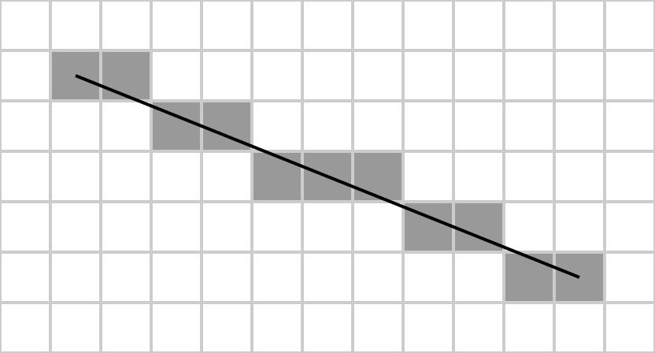

<script type="text/x-mathjax-config">
  MathJax.Hub.Config({ TeX: { equationNumbers: {autoNumber: "all"} } });
</script>


# Project1

## 具体内容

1. 安装pygmo库

2. 下载代码

   ```
   > git clone https://github.com/panlei7/summer-project.git
   ```
   如果没有git命令，可以安一个
   ```
   > sudo apt-get install git
   ```

   反演程序来自scipy和pygmo，正演我已经提供了，我已经写好了一个检测板模型的例子，你们可以参考一下

3. 具体怎么执行，还有参数的设定问题，到时候课上会讲，写起来太费劲，自己可以摸索试一下

## 解释

### 走时成像

我们在项目1里将实现简化版本的走时成像。什么是走时成像？地震波经过不同性质的介质会有快慢，给定源和接收点的位置，就可以计算到达时间，根据到时的不同可以判断经过介质的速度的快慢。我在网上找了几个相关的视频，比较简单，你们可以看一下，有个直观的印象。

[走时曲线是如何产生的？](https://www.iris.edu/hq/inclass/animation/traveltime_curves_how_they_are_created)

[地震成像类比医学上的CT扫描](https://www.iris.edu/hq/inclass/animation/seismic_tomography_ct_scan_as_analogy)

[地震波的行为：沿地球的曲线路径](https://www.iris.edu/hq/inclass/animation/seismic_wave_behavior_curving_paths_through_the_earth)

[地震波的行为：单层界面反射和折射](https://www.iris.edu/hq/inclass/animation/seismic_wave_behavior_a_single_boundary_refracts__reflects)

看完视频后，会发现射线在经过速度变化区域时会发生弯曲，并不是一条直线。张伟老师项目中提到的方法是考虑到这种情况的。我们为了简单起见，假设射线沿直线传播。除此以外，我们还假设只要射线经过一个格点，那它在格点里经过的距离为一个格点长度。如果你感兴趣，可以思考如何计算射线在格点里实际经过的距离。


### 如何获得路径经过的网格

射线路径问题，有时候又叫射线追踪问题，是走时反演中一个很重要而且相对复杂的部分。由于我们做了直线假设，所以可以通过Bresenham算法获得射线经过的网格。

[Bresenham's algorithm](https://en.wikipedia.org/wiki/Bresenham%27s_line_algorithm)




### 目标函数和梯度

这个有很多名字，例如misfit function, fitness function, object function等，但都是一个东西，它是用来衡量反演模型产生的合成数据与观测数据之间差别的函数。所有的反演方法都需要先定义一个目标函数，才能进行各种策略，最终获得一个满意的反演模型。

- 数据模型（我们不知道，例如地下什么结构，这个是我们不知道的）
- 观测数据（我们可以获得或观测到，例如地震波的到时，之前我讲过的面波频散曲线）
- 反演模型（我们在反演过程中得到的模型，它可以看作是对实际的数据模型的假设、猜测）
- 合成数据（根据反演模型正演得到的数据，它用来和观测数据比较，计算出目标函数）

反演里的梯度有时候又叫导数、核函数，它含有改进模型方向的信息。打个比方，你现在在A地点，要去B地点，你去问路人“梯度”，它会告诉你个方向，但具体要走多远，会不会走过，它并不知道，这时候需要经常看看手里的“目标函数”，就这样停停问问看看，最后你到了目的地。

走时可以通过以下公式求得

$$
T = \int \frac{1}{c}dl
$$

积分是射线经过的路径，$c$是波速，$T$是走时。进行微分，得到

$$
\delta T = -\int \frac{\delta c}{c^2}dl \label{eq:1}
$$

假设所有网格的集合为$S$，而利用Bresenham算法求得最短路径经过的网格集合为$S_{l}$，那么可以定义一个窗函数，满足

$$ W(m, n) = \begin{cases} 
1, & \text{if $(m, n)$} \in S_{l} \\\\
0, & \text{if $(m, n)$} \in S \text{,} \notin S_{l}
\end{cases}
\label{eq:2}
$$

对公式$\eqref{eq:1}$进行离散化，并使用窗函数$\eqref{eq:2}$将沿路径的线积分转换成面积分

$$
\begin{align}
\delta T & = -\int \frac{\delta c}{c^2}dl \nonumber \\\\
& = -\sum_{m, n} \frac{W(m, n)}{c^2(m, n)}\delta c
\end{align}
$$

所以kernel函数的离散形式为：

$$
k(m, n) = -\frac{W(m, n)}{c^2(m ,n)}
$$

现在定义一个目标函数：

$$
F = \frac{1}{2}\sum_{r, s}(T_{r, s} - T'_{r, s})^2 \label{eq:3}
$$

其中$T_{r,s}$是第$s$个源和第$r$个接收点对应的测量到时，而$T'_{r, s}$是数据到时。
对上式微分得，

$$
\begin{align}
\delta F & = \sum_{r, s}(T_{r, s} - T'_{r, s})\delta T_{r,s} \nonumber \\\\
& = \sum_{r, s}(T_{r, s} - T'_{r, s})\sum_{m, n}k(m, n)\delta c \nonumber \\\\
& = \sum_{m, n}\sum_{r, s}(T_{r, s}-T'_{r, s})k(m ,n)\delta c
\end{align}
$$

所以目标函数$\eqref{eq:3}$对应的kernel函数为

$$
K(m ,n) = -\sum_{r, s}\frac{(T_{r, s}-T'_{r, s})W(m, n)}{c^2(m ,n)}
$$

这里的kernel函数就是我们需要的梯度信息。
